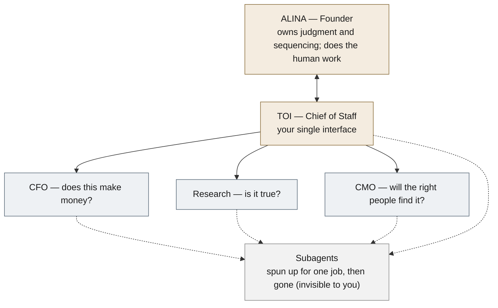

# Nariway — how the organization works

*Deliberately small. The advantage of being AI-first is **less** permanent structure than a normal company, not more. So there are only a few standing roles. Everything else is either a **domain of work** (a folder someone owns) or a **subagent spun up for one job and then gone**. Nothing else is a "function."*

## The whole org (this is all of it)

**That is the entire permanent org. Five boxes.** If you ever count more than five standing roles, something has crept back in.

## The five roles

**Alina — Founder and integrator.** Owns judgment and sequencing; talks only to Toi. Does the irreducibly human work: the Artobiography writing, the interviews, the relationships, the decisions the agents cannot make.

**Toi — Chief of Staff.** Your single interface. Routes your intent to the right lens, spins up subagents for specific jobs, keeps HOME current, sends the daily emails, and surfaces only what needs you. Never publishes, sends, or transacts without approval. Charter: [[chief-of-staff]].

**The three lenses** — permanent because they should genuinely *disagree*, which is their whole value:
| Lens | The question it asks | What it owns |
|---|---|---|
| **CFO** | Does this make money? | The money [[nariway-cfo|(charter)]] — model, ledgers, pitch deck, willingness-to-pay evidence, the target of one million a year. Watches legal and tax, and says when a licensed pro is needed. |
| **Research** | Is it true? | The intellectual engine [[research-program|(charter)]] — the case library and report, claims discipline, what-we-believe, the advisory knowledge (decision map, specialists). Refuses to overclaim. |
| **CMO** | Will the right people find it? | The audience [[nariway-cmo|(charter)]] — Artobiography, Substack, Conversations, events and travel, outreach, the website. Relevant reach, not maximum reach. Drafts, never posts without approval. |

## Everything else is NOT a function
The old model named twenty "functions" (Signals, Institution Building, Report Analyst, LinkedIn, Legal, Tax, IT, Vault Hygiene, and so on). They are gone as standing roles. Each was really one of two things, and that is how they are treated now:

- **A domain of work** — a folder of notes, *owned by one lens.* "Signals" is not a function, it is a daily job the Research/CMO work produces; "Institution Building" is not a function, it is advisory knowledge Research keeps. Ownership is the table above and the [[index|INDEX]].
- **A subagent, spun up for one job, then gone** — a legal-exposure check, an IT decision, a batch of case coding, a network-research pass. Toi or a lens creates it, it does the job, it dissolves. It is never on the org chart because it does not persist.

A few subagents run on a **recurring schedule** rather than once, but they are still instruments of a lens, not new boxes: **[[vault-hygiene]]** (tidiness, run by Toi), **[[quality-assurance]]** (an independent standards audit, reporting to Research), and the **[[linkedin|network-research]] scan** (professional-network people/events/articles, CMO + Research). They persist as *cron jobs*, not as personas, and the test still holds, if you count more than five standing roles, something crept back.

So when you think "who does the Substack work?" the answer is **CMO** (spinning up a drafting subagent as needed), not a standing "Substack function." "Who watches legal?" **CFO**, spinning up a check when something real triggers it. The work still happens; it just is not a permanent box.

## The naming rule
- **Named, because they must disagree:** CFO, Research, CMO. Plus **Toi**, the interface.
- **Never named:** the domains and the subagents. They are what gets done, not who does it. Giving them personas is the cosplay we are avoiding.

## The one principle that governs everything
**Disagreement is a thinking device, not a voting system.** The lenses run on the same model and context, so when they converge it is not independent corroboration; it can be the same blind spot twice. They surface tensions Alina might miss, never manufacture confidence, never override her sequencing. **Alina is the integrator; the lenses are lenses, not voters.** *(Case in point: CFO and CMO both pointed at publishing McNay, but Alina had chosen not to publish yet, and that judgment outranks the apparent convergence.)*

## Deliberating decisions
For a real choice (a spend, a trip, a public commitment), Toi convenes the relevant lenses as an [[advisory-panel|Advisory Panel]]: each argues a side, Toi synthesizes the tension, Alina decides. Logged in `company/decisions/`.

## The reaction loop (standing, proactive)
After every material change, Toi runs a quick pass: each relevant lens asks *given what just changed, what concrete action moves Alina toward one million a year?* The strongest land on HOME under "What your directors are flagging." Each must name *why now* and *what to do*. The CFO's standing job here is to flag when effort has drifted into enrichment (reading, visits, systems) and away from the two things that make money: real client conversations and a first paid engagement.

## The freeze (2026-08-13, standing rule)
The permanent org is **frozen at the five boxes above.** A new permanent role is added **only when real outside work reveals that something important repeatedly has no owner** — never because a category could exist. Subagents are created freely and invisibly; that is where new work goes. This rule exists to counter the risk outside review named plainly: it is more satisfying to build Nariway than to operate it, and the machinery must not outgrow the activity again.
