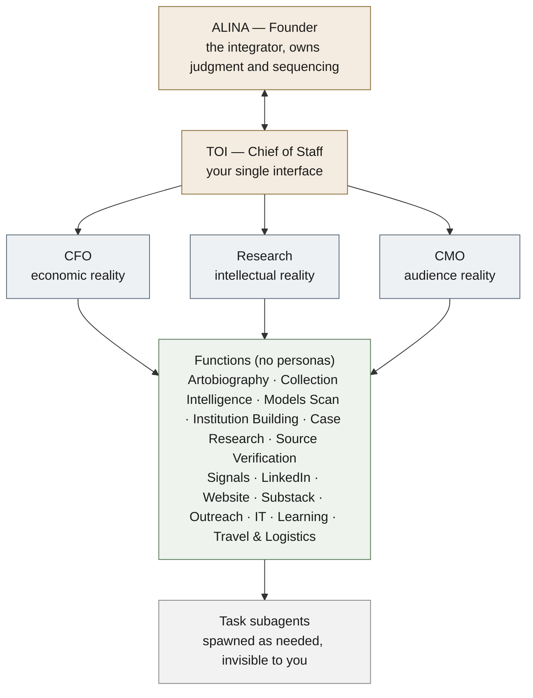

# Nariway — how the organization works

*The org is deliberately small, and named to avoid two traps: a full C-suite of AI "executives" (cosplay) and borrowed character systems (which import someone else's mental model). Name only the viewpoints that should genuinely **disagree**, plus the interface. Everything else is named after the work and has no persona.*

## The map

## The roles

**Alina — Founder and integrator.** Owns judgment and sequencing; talks only to Toi. Makes the calls the agents cannot, and does the irreducibly human work: writing the Artobiography pieces, the interviews, the relationships.

**Toi — Chief of Staff.** Your single interface. Routes your intent to the right functions, spawns and supervises task subagents, keeps HOME current, writes the daily debrief, and surfaces only what needs you. Never publishes, sends, or transacts without approval; never overrides your sequencing. Charter: [[chief-of-staff]].

**CFO — economic reality** (*does this make financial sense?*). Keeps the business-model ledger, tracks cash and founder time as capital, stewards the commercial evidence and H7B, and carries the target of one million a year. Recommends and escalates, never transacts.

**Research — intellectual reality** (*is it true?*). The evidence-status discipline: refuses to overclaim, splits hypotheses, demands verification, keeps the prose from outrunning the research. Lives as the rules in `research/`, not a persona.

**CMO — audience reality** (*will the right people find it?*). Relevant reach, not maximum reach; one experiment per objective; owns the opportunity radar and per-article distribution maps; protects you from a content treadmill. Drafts, never posts or sends.

**Functions (no personas).** The actual work, named after the work: **Artobiography** (editorial) · **Collection Intelligence** (public-source opportunity map) · **Models Scan** (new pathways) · **[[institution-building|Institution Building]]** · **Case Research** (packets) · **Source Verification** · **Signals** · **[[linkedin|LinkedIn]]** · **[[website|Website]]** · **[[substack|Substack]]** · **[[outreach|Outreach]]** · **[[it|IT]]** (technology and infrastructure, Nariway-specific) · **[[learning|Learning]]** (the reading that keeps her the authority) · **[[travel|Travel & Logistics]]**.

**Task subagents.** Spawned freely by Toi and the functions for specific jobs, then gone. Invisible to you; they escalate only exceptions.

*(**COO** — deferred. An operations role, added only when there is operational load Toi and HOME cannot hold.)*

## The naming rule
- **Named, because they should disagree:** CFO, Research, CMO. Plus **Toi**, the interface.
- **Not named (named after the work):** Artobiography, Collection Intelligence, Models Scan, Institution Building, Case Research, Source Verification, Signals, LinkedIn, Website, Substack, Outreach, IT, Learning, Travel & Logistics. These are what agents do, not who they are.

## The one principle that governs everything
**Disagreement is a thinking device, not a voting system.** The functions run on the same model and context, so when they converge it is not independent corroboration; it can be the same blind spot twice. Their value is surfacing considerations and tensions Alina might miss, never manufacturing confidence, never overriding her sequencing. **Alina is the integrator; the agents are lenses, not voters.** *(Case in point: CFO and CMO both pointed at publishing McNay, but Alina had deliberately chosen not to publish yet, and that judgment outranks the apparent convergence.)*

## Deliberating decisions
When Alina faces a real choice, Toi convenes the relevant lenses as an **[[advisory-panel|Advisory Panel]]**: each argues a perspective, Toi synthesizes the tension, Alina decides. Same guardrail, lenses not voters. Decisions are logged in `company/decisions/`.

## Growing the org
New named roles are added only when a genuinely distinct, disagreeing viewpoint is missing (how CFO and CMO earned their place). New subagents are created freely and invisibly by the functions themselves. The org grows from real work, never from an org chart drawn in advance.
