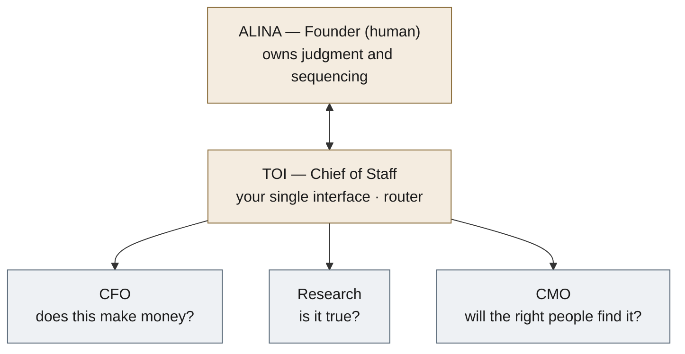

# Nariway — how the organization works

*Deliberately small. Being AI-first means **less** permanent structure than a normal company, not more. **Visual org chart: [The Digital Workforce](https://claude.ai/code/artifact/477c16e5-0cd8-4558-ba79-adb8ea33b216)** (1 human, 5 permanent roles, 6 live agents, the on-demand subagents under each lens).*

## The whole org — five boxes

**That is the entire permanent org.** If you ever count more than five standing roles, something crept back in.

| Role | Asks | Owns |
|---|---|---|
| **Alina** — founder, integrator (human) | — | Judgment, sequencing, and the human work: the writing, the interviews, the relationships. Talks only to Toi. |
| **Toi** — Chief of Staff | — | The interface. Routes intent, spins up subagents, runs Operations, surfaces only what needs Alina. Never sends or transacts without approval. [[chief-of-staff|Charter]]. |
| **CFO** | does this make money? | The money [[nariway-cfo|(charter)]] — model, ledgers, pitch deck, willingness-to-pay, the million-a-year target. Watches legal and tax. |
| **Research** | is it true? | The intellectual engine [[research-program|(charter)]] — the case library and report, claims discipline, beliefs, advisory knowledge. Refuses to overclaim. |
| **CMO** | will the right people find it? | The audience [[nariway-cmo|(charter)]] — Artobiography, Substack, Conversations, events, outreach, the website. Drafts, never posts without approval. |

## The digital workforce — the agents actually running
Everything below is an **agent**, not a role. **Live agents** run on a schedule in the cloud, 24/7, whether the laptop is on or off. **On-demand subagents** are spun up for one job and dissolve. Each belongs to one of the five boxes. (Live schedules also in [[it]]; full picture in the [visual](https://claude.ai/code/artifact/477c16e5-0cd8-4558-ba79-adb8ea33b216).)

| Live agent | Owner | Cadence | Job |
|---|---|---|---|
| **dataset-research** | Research | 2×/day (5am, 5pm ET) | codes the case database to primary-source depth (the proprietary moat) |
| **signals** | Research | daily (7am ET) | scans the art world → cases, prospects, market intelligence; emails the digest |
| **quality-assurance** | Research | daily (4pm ET) | independent standards audit; flags, never fixes |
| **network-research** | CMO | Mon/Thu (9am ET) | public-web + LinkedIn sweep → events, people, articles |
| **check-in** | Toi (Ops) | daily (7:30am ET) | morning brief + "today I learned"; refreshes HOME |
| **vault-hygiene** | Toi (Ops) | M/W/F | tidiness: stale info, duplicates, drift, broken links |
| **email-sender** | Toi (Ops, infra) | on push | GitHub Action; sends the queued emails via Resend |

**On-demand subagents** (representative, spun up as work needs them): *Research* — case-coder, source-verifier, claims-keeper, beliefs-updater, institution-builder · *CMO* — substack-drafter, artobiography-editor, conversations-interviewer, events-scout, outreach-drafter, website-builder · *CFO* — ledger-keeper, pitch-deck-builder, comparables-analyst, legal-watch, tax-watch · *Toi* — intent-router, home-keeper, panel-convener.

**Why the roster is optimal (the audit, 2026-08-14):** every live agent maps to exactly one lens, so there is no ownerless work and no duplicated owner. The two outward scans stay complementary, not redundant — **signals** covers art-world *developments*, **network-research** covers the *professional ecosystem* (people, rooms, thought-leadership). **quality-assurance** is deliberately independent (it audits the others; it does not report to the work it checks). **CFO has no cron** on purpose — money work is judgment-heavy and runs on demand. New standing agents are added only when a real, repeating job has no home (see the freeze).

## The rules that keep it small
- **Everything that is not one of the five boxes is a domain or an agent, never a new "function."** A domain is a folder one lens owns (Signals, Institution Building, Substack). An agent is the live or on-demand worker above.
- **Named only if it must disagree:** CFO, Research, CMO, plus Toi the interface. The agents are named after the *work* (kebab-case), never given personas — that is the cosplay we avoid.
- **The freeze (standing rule, 2026-08-13):** the permanent org is frozen at five. A new permanent role is added only when outside work reveals something important that repeatedly has no owner, never because a category could exist. New work goes to subagents. This exists because it is more satisfying to build Nariway than to operate it, and the machinery must not outgrow the activity.

## How judgment and decisions work
- **Disagreement is a thinking device, not a vote.** The lenses share a model and context, so convergence can be the same blind spot twice. They surface tensions; **Alina integrates and decides.** They never override her sequencing. *(McNay: CFO and CMO both said publish, Alina chose not to yet, and that judgment won.)*
- **Advisory Panel** — for a real choice (a spend, a trip, a public commitment), Toi convenes the relevant lenses, each argues a side, Toi synthesizes the tension, Alina decides. Logged in `company/decisions/`. See [[advisory-panel]].
- **The reaction loop** — after every material change, each relevant lens asks *what concrete action moves Alina toward a million a year?* The strongest land on [[HOME]]. The CFO's standing job here is to flag when effort drifts into enrichment (reading, visits, systems) and away from the two things that make money: real client conversations and a first paid engagement.
