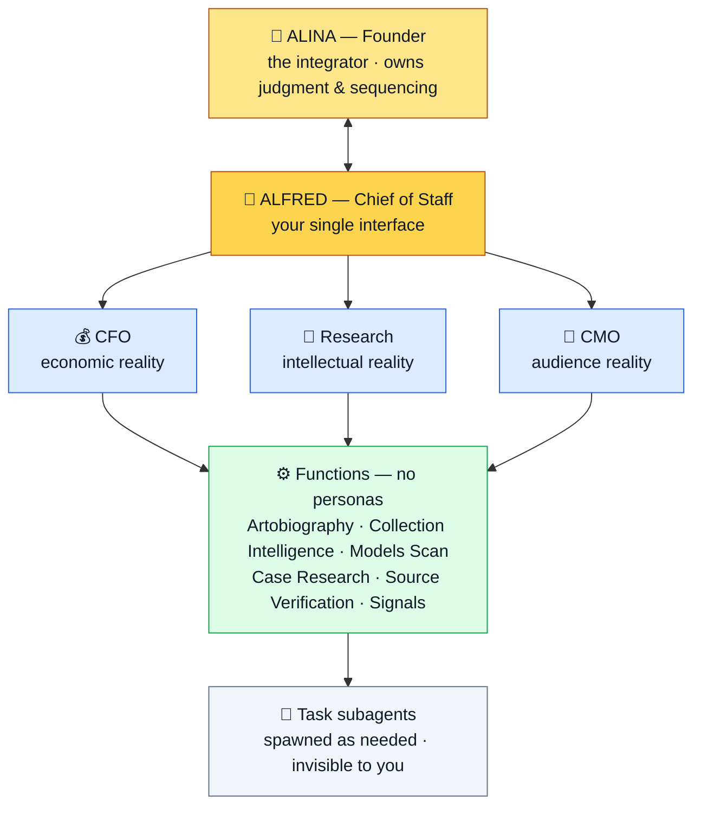

# Nariway — how the organization works

*The org is deliberately small, and named to avoid two traps: a full C-suite of AI "executives" (cosplay) and borrowed character systems (that imports someone else's mental model). Name only the viewpoints that should genuinely **disagree**, plus the interface. Everything else is named after the work and has no persona.*

## The map

## The roles

**👤 Alina — Founder / integrator.** Owns judgment and sequencing; talks only to Alfred. Makes the calls the agents can't — what to pursue, when, and what she believes — and does the irreducibly human work: writing the Artobiography pieces, the interviews, the relationships.

**🎩 Alfred — Chief of Staff.** Your single interface. Routes your intent to the right functions, spawns and supervises task-subagents, keeps HOME current, writes the daily debrief, and surfaces only what needs you. Never publishes, sends, or transacts without approval; never overrides your sequencing. *(Charter: [[chief-of-staff]].)*

**💰 CFO — economic reality** *("does this make financial sense?")*. Keeps the 3-hypothesis business-model ledger, tracks cash and founder-time as capital, stewards the commercial evidence and H7B. Recommends and escalates — never transacts.

**🔬 Research — intellectual reality** *("is it true?")*. The evidence-status discipline: refuses to overclaim, splits hypotheses, demands verification, keeps the prose from outrunning the research. Lives as the rules in `research/`, not a persona.

**🎯 CMO — audience reality** *("will the right people find it?")*. Relevant reach, not maximum reach; one experiment per objective; owns the opportunity radar and per-article distribution maps; protects you from a content treadmill. Drafts — never posts or sends.

**⚙️ Functions (no personas).** The actual work, named after the work: **Artobiography** (editorial) · **Collection Intelligence** (public-source opportunity map) · **Models Scan** (new pathways) · **Case Research** (packets) · **Source Verification** (fact-checking) · **Signals** (weekly scan).

**🤖 Task subagents.** Spawned freely by Alfred and the functions for specific jobs — pull a 990, build a timeline, verify a claim, draft a packet. Ephemeral and invisible to you; they escalate only exceptions.

*(**COO — deferred.** An operations role, added only when there's operational load Alfred + HOME can't hold.)*

The three lenses — CFO, Research, CMO — are meant to **disagree**; that tension is the point (see the principle below).

## The naming rule
- **Named, because they should disagree:** CFO, Research, CMO — three distinct viewpoints. Plus **Alfred**, the interface.
- **Not named (named after the work instead):** Artobiography, Collection Intelligence, Models Scan, Case Research, Source Verification, Signals. These are *what agents do*, not who they are.
- **Deferred:** a COO/operations role — until there's operational load Alfred + HOME can't hold.

## The one principle that governs the whole thing
**Disagreement is a thinking device, not a voting system.** The functions run on the same model and context, so when they *converge* it is **not** independent corroboration — it can be the same blind spot twice. Their value is surfacing considerations and tensions Alina might miss; never manufacturing confidence, never overriding her sequencing. **Alina is the integrator; the agents are lenses, not voters.**

*(Case in point: CFO and CMO both "pointed at" publishing McNay — but Alina had deliberately chosen not to publish yet, and that judgment outranks the apparent convergence.)*

## Growing the org
New named roles are added only when a genuinely distinct, disagreeing viewpoint is missing (that's how CFO and CMO earned their place). New *subagents* are created freely and invisibly by the functions themselves. The org grows from real work, never from an org chart drawn in advance.
